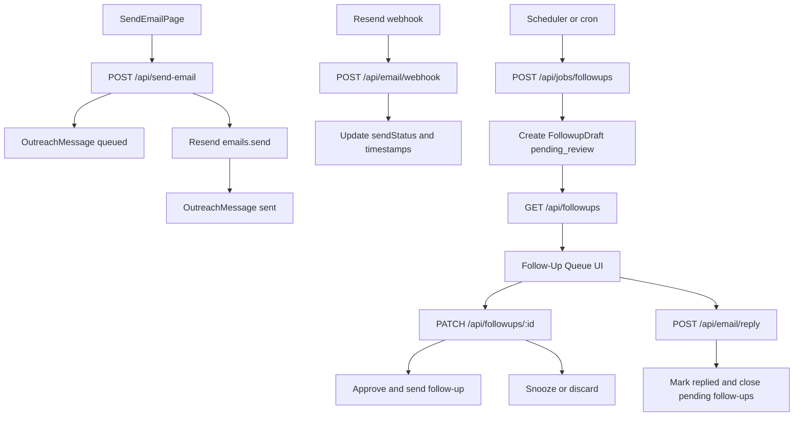

# Database + Follow-Up Implementation Guide

## Goal

This document defines the production data layer and workflow used to:

- persist every outbound email and its lifecycle status,
- track reply / no-reply outcomes,
- generate reviewable follow-up drafts automatically when no response is received,
- and support a follow-up queue with edit, approve/send, snooze, discard, and mark-replied actions.

The implementation uses **Prisma + PostgreSQL** with **Resend** as the email provider.

---

## System Architecture



---

## Data Model

Schema source: `prisma/schema.prisma`

### Enums

- `ContactStatus`: `active | archived`
- `MessageKind`: `initial | followup`
- `ProviderType`: `resend`
- `SendStatus`: `queued | accepted | sent | delivered | failed | bounced | complained | canceled`
- `ResponseStatus`: `unknown | replied | no_response`
- `FollowupState`: `none | due | drafted | sent | skipped | closed`
- `FollowupDraftStatus`: `pending_review | approved | sent | discarded`
- `TemplateKind`: `initial | followup`

### Tables

1. **Contact**
   - Per-user contact identity and profile metadata.
   - Unique constraint: `(userId, email)`.

2. **OutreachMessage**
   - One row per sent message (initial or follow-up).
   - Includes delivery lifecycle, response status, and follow-up scheduling metadata.
   - Self-reference via `parentMessageId` for follow-up chains.
   - Unique constraint: `(provider, providerMessageId)` for provider correlation.

3. **MessageEvent**
   - Immutable event timeline per message (`message.queued`, `message.sent`, `email.delivered`, etc.).
   - `providerEventId` unique to support webhook idempotency.

4. **FollowupDraft**
   - Review queue item for unsatisfied outreach.
   - Stores editable subject/body draft with due date and workflow status.

5. **Template**
   - Reusable template records for initial and follow-up content.
   - Can be user-scoped (`userId`) or global default (`isDefault=true`).

---

## Status Model (State Separation)

Three state dimensions are stored independently:

1. **Delivery state** (`sendStatus`)
   - Provider lifecycle for transport and delivery.
2. **Reply state** (`responseStatus`)
   - Whether the recipient has replied.
3. **Follow-up state** (`followupState`)
   - Follow-up workflow progression (drafted, sent, skipped, closed).

This separation prevents ambiguous states and supports clear dashboard filtering.

---

## API Contracts

### 1) Send email and persist lifecycle

`POST /api/send-email`

Request body:

```json
{
  "to": "person@example.com",
  "subject": "Intro",
  "body": "Hi ...",
  "contactId": "optional",
  "contactName": "optional",
  "contactCompany": "optional",
  "kind": "initial",
  "sequenceNumber": 0,
  "parentMessageId": "optional",
  "scheduledAt": "optional-iso-string"
}
```

Behavior:

- validates payload,
- resolves signed-in user,
- upserts contact,
- creates `OutreachMessage(sendStatus=queued)`,
- logs `MessageEvent(message.queued)`,
- sends through Resend,
- updates message to `sent` (or `failed`) and persists provider message ID,
- returns `messageId` and provider ID.

### 2) Webhook status sync

`POST /api/email/webhook`

Behavior:

- verifies Resend svix signature (`RESEND_WEBHOOK_SECRET`),
- maps provider event types to `sendStatus`,
- uses `providerEventId` for idempotent event insertion,
- updates message timestamps (`deliveredAt`, `failedAt`) and status.

### 3) Manual reply logging

`POST /api/email/reply`

Request body:

```json
{
  "messageId": "msg_123",
  "replyText": "optional note"
}
```

Behavior:

- marks original message `responseStatus=replied`,
- marks follow-up flow `closed`,
- discards any pending or approved drafts for that message chain,
- logs `message.replied`.

### 4) Follow-up queue fetch

`GET /api/followups`

Response includes grouped sections:

- `needsReview`
- `dueSoon`

- `overdue`
- `closed`

Each draft includes contact + message timeline events.

### 5) Follow-up draft actions

`PATCH /api/followups/:id`

Supported actions:

- `save` (edit draft subject/body)
- `approve_send` (send follow-up via Resend, create follow-up `OutreachMessage`)
- `snooze` (move due date)
- `discard` (discard draft and mark parent skipped)
- `mark_replied` (close flow as replied)

---

## Scheduler / Automation Rules

Route: `POST /api/jobs/followups`

Auth:

- Requires `x-job-secret` header matching `FOLLOWUP_JOB_SECRET`.

Eligibility query:

- `sendStatus IN (sent, delivered)`
- `responseStatus != replied`
- `followupState IN (none, due)`
- `nextFollowupDueAt <= now`
- `sequenceNumber < FOLLOWUP_MAX_SEQUENCE`
- no open `FollowupDraft` in `pending_review` or `approved`

Actions for each eligible message:

1. Select follow-up template (`user` template first, then default).
2. Create `FollowupDraft(status=pending_review)`.
3. Update message: `followupState=drafted`, `responseStatus=no_response`.
4. Set next due timestamp using `FOLLOWUP_DELAY_DAYS`.
5. Append `MessageEvent(followup.draft_created)`.

---

## UI Behavior

### Follow-Up Queue Page

Path: `src/app/start-networking/followups/page.tsx`

- Loads grouped follow-up sections from `/api/followups`.
- Renders editable follow-up forms per draft.
- Supports one-click actions:
  - Save edits
  - Approve & Send
  - Snooze 2 days
  - Mark Replied
  - Discard
- Shows message event timeline per draft using `MessageStatusTimeline`.

### Send Page Tracking Link

Path: `src/app/start-networking/send/page.tsx`

- After a successful send, stores returned `messageId` and shows a direct link to the follow-up queue for status tracking.

---

## Environment Variables

Defined in `.env.example`:

- `DATABASE_URL`
- `RESEND_API_KEY`
- `RESEND_FROM_EMAIL`
- `RESEND_WEBHOOK_SECRET`
- `FOLLOWUP_DELAY_DAYS`
- `FOLLOWUP_MAX_SEQUENCE`
- `FOLLOWUP_JOB_SECRET`

---

## Migration and Setup

1. Install dependencies:
   - `@prisma/client`
   - `prisma`
   - `@prisma/adapter-pg`
   - `pg`
2. Generate client:
   - `npm --prefix "Networking-Service" exec -- prisma generate --schema "Networking-Service/prisma/schema.prisma"`
3. Create and apply migration (with DB running):
   - `npm --prefix "Networking-Service" exec -- prisma migrate dev --schema "Networking-Service/prisma/schema.prisma" --name init_email_tracking`

---

## FR-11 to FR-16 Validation Checklist

### FR-11: Message send status visibility

- [ ] `OutreachMessage.sendStatus` updates correctly from queued -> sent -> delivered/failed.
- [ ] Webhook events update message status and timestamps.

### FR-12: Reschedule/cancel support for queued messages

- [ ] `scheduledAt` is persisted on outbound messages.
- [ ] Cancel/schedule extension paths can update `sendStatus=canceled` safely.

### FR-13: Track conversation/outreach history per contact

- [ ] `MessageEvent` timeline is complete and queryable by `contactId`.
- [ ] Follow-up queue shows message event history.

### FR-14: Log replies and follow-up actions

- [ ] Manual reply endpoint marks message replied and appends `message.replied`.
- [ ] Follow-up actions append corresponding events.

### FR-15: Surface pending follow-ups clearly

- [ ] Queue endpoint groups drafts into review/due/overdue/closed sections.
- [ ] Queue UI surfaces each section with counts.

### FR-16: Reminder prompts for follow-up deadlines

- [ ] Job route creates pending review drafts when `nextFollowupDueAt` passes.
- [ ] Snooze and due date updates are reflected in queue ordering.
